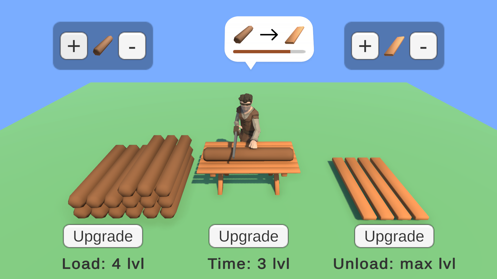

# Sawmill

### Описание
Проект демонстрирует пример реализации системы апгрейдов, основанной на поведенческом паттерне "Шаблонный метод". Проект разделен на слой бизнес логики и слой представления (View). Используются различные паттерны и принципы.

### DI System
- VContainer

### Примененные принципы
- ООП
- SOLID
- DRY
- KISS
- YAGNI 

### Примененные паттерны
- Template Method (GoF)
- Information Expert (GRASP)
- Indirection (GRASP)
- Creator (GRASP)
- Low Coupling / High Cohesion (GRASP)
- Polymorphism (GRASP)
- Indirection (GRASP)
- Protected Variations (GRASP)
- MVP-Passive (MV*)
- Presentation Model (MV*)

### Скриншоты

